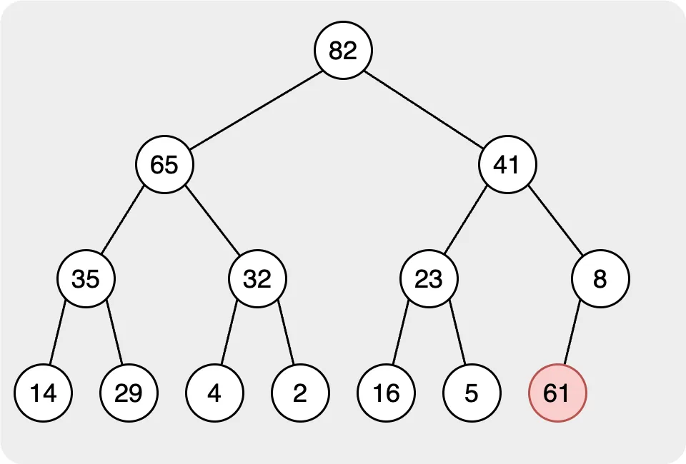
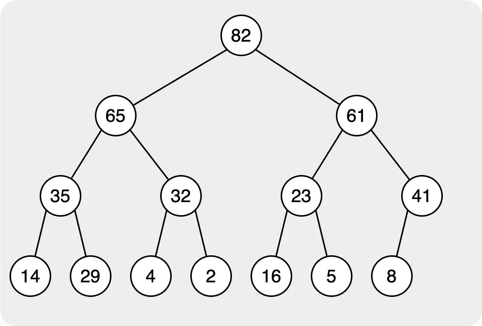
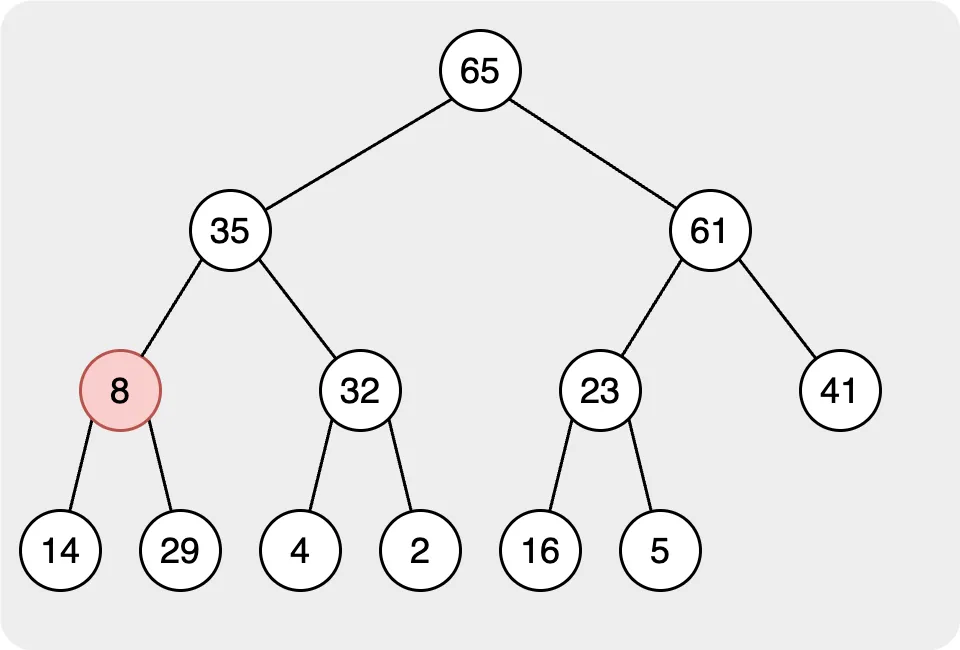
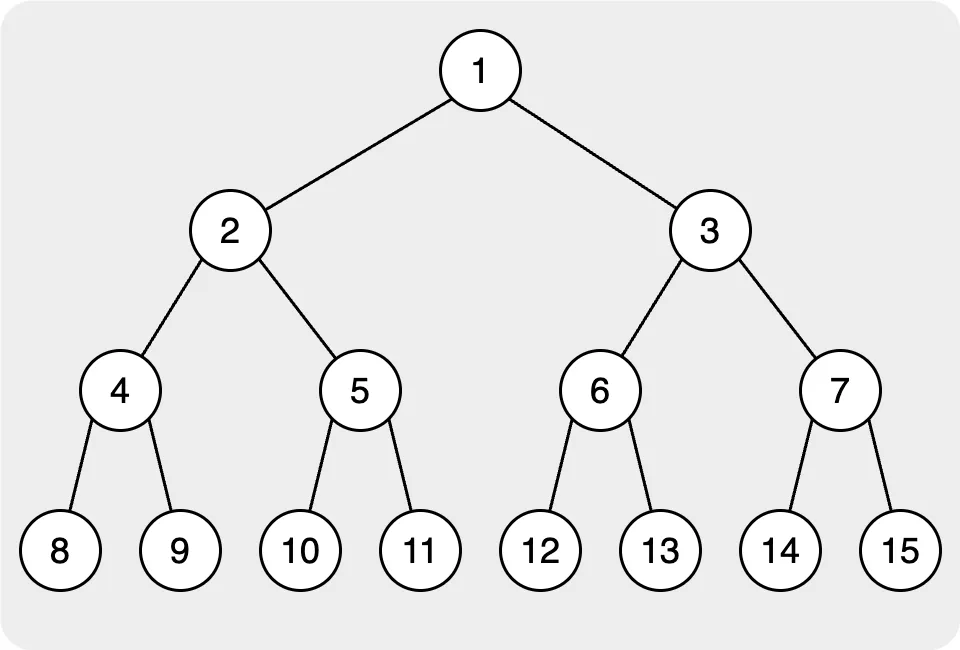
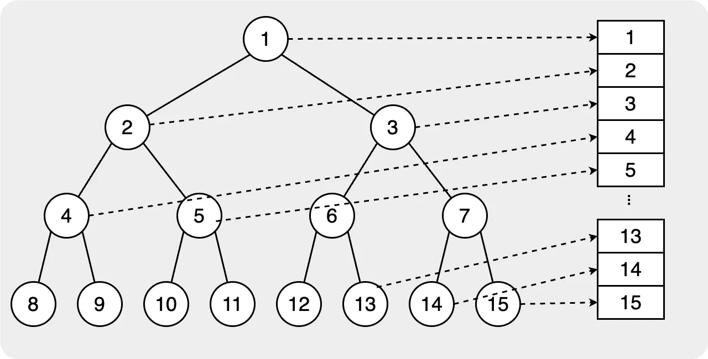

# Heap

The heap sort uses the "Complete Binary Tree" to maintain the data structure. In the heap sort, there are two common heap sorts: one is "minimum heap", and the other is "maximum heap". The idea of these two are that the root node of the binary tree will be the minimum or the maximum of all nodes.

 

## Maintain a Heap

For the following, I will use the maximum heap for the demonstration. In the heap, we will focus on the two behavior are insert and pop max/min.

### Insert

The first step for building the max/min heap is inserting all nodes into the heap and making those nodes comply with the rule. In the heap, we usually use the complete binary tree to maintain the data structure, when there is a node that need to be inserted into the tree, it need to be the last layer and align to left.

After inserting the node into a heap, we must let the node follow the rule. In the maximum heap, all parent nodes' values need to be larger than the children nodes. Therefore, we need to compare the node value we insert with its parent. If the parent node's value is smaller than the child's, we need to switch them. Then, keep comparing the value until the root node.

 

In the image above, we can see that we add the node with the value 61. First, we add the node to the last layer and algin to left. Seconde, we need to let the node we added follow the rule of the max heap. We need let the value of the parent node larger than the child node. Therefore, we start to compre the value from the node we added to the root, if child is larger than the parents', we need to switch them. Finally, when we check the node to the root, you will find that the all nodes in heap are follwing the rule. It also means that the while inserting is finished.

### Pop

In the max/min heap, we will use the pop to get the max/min node in the heap. After we remove the max/min node in the heap, there will be no root node. So, we need to rearrange the heap to allow it to follow the rules of the heap. 

When we want to remove the root node which represent the max/min node in the heap, we will move the leftest node in the last layer as the root node. Then rearrange the heap.

 

In the second step, we need to find the correct place for the root node. In this step, we will compare the target node to its children. If the value of the target node is smaller than the children's, we will swap with the node with the largest value node Then, continue to compare the nodes until all nodes follow the rule.

  

Until all the target nodes and their children follow the rule, we finish all steps in the pop behavior.

## Heap Sort

When we know what is the heap, the heap sort is also a very common sorting people will use. Beacuse for building the heap when insert a node we only spend `O(logn)` time for rearrange the heap. So, the total time of the heap sort will be `O(nlogn)`.

When using the heap sort, it means we put all unsorted numbers into the heap and build the max/min heap. To get the result, just pop out the nodes in order, and we can get the sorted number.

## Data Structure Container in Heap

As we talk above, the heap usually uses the complete binary tree to maintain the heap. However, in programming, it is not easy to implement and maintain the binary tree. We usually change the binary tree into the vector for easy maintaining. For changing the binary tree to the vector, first we need to get all nodes' index and the relationship of them.

In this situation, we always let the index start from one, and in the binary tree, it will start from root to leaf and left to right. So, the index of each node will be like the image below.

As the image above shows the index of the left child will be `2 * idx` and the right child will be `2 * idx + 1`; it will help us easily find the child node when we use the vector. Then, if we want to get the parent node's idx, it will be `floor(idx / 2)`. In this way, we can use the index to find the parent node or the children node very quickly.

## Heap in C++

When understanding the concept of the heap, for the people using C++, there is an STL container for us to use the heap. This section we will introduction how to use the heap in C++.

In the C++, the `priority_queue` is implement by heap. As the default, if we only set the type of data of **priority_queue** it will set as the maximum heap. And the default the container of the **priority_queue** is the vector. If you want to change the maximum heap to the minimum heap, you can use the build-in Compare call `greater<T>` to set the **priority_queue** to the minimum heap.

> The Compare parameter is defined such that it returns true if its first argument comes before its second argument in a weak ordering. But because the priority queue outputs largest elements first, the elements that "come before" are actually output last. - By [cppreference.com](https://en.cppreference.com/w/cpp/container/priority_queue)

Common member function in heap:

- `push()`: insert the element and sort
- `pop()`: remove the top element
- `top()`: access the top element
- `empty()`: check whether the heap is empty or not
- `size()`: return the number of the elements

> If you want to design your compare funstion, please check out the [cppreference.com](https://en.cppreference.com/w/cpp/container/priority_queue) for detail information.

{}

