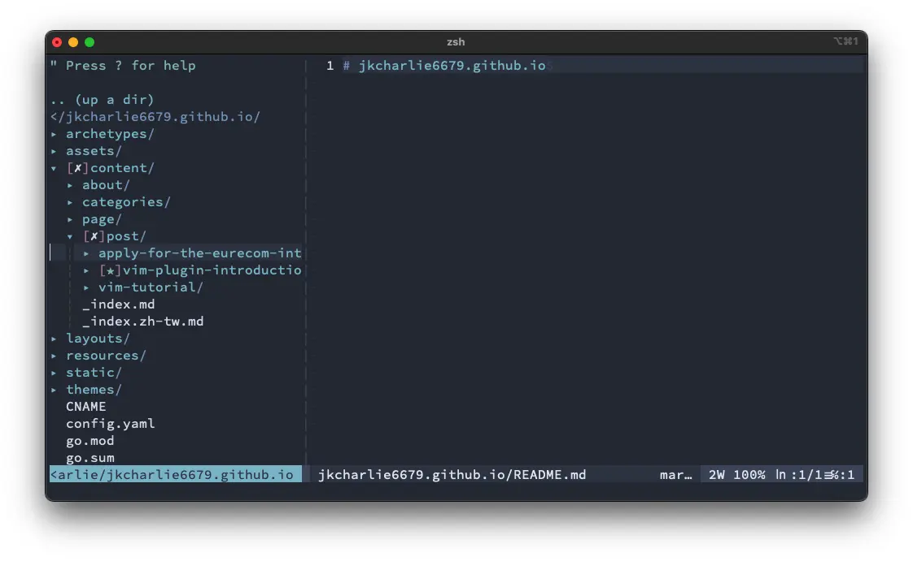

在一些熱門的編輯器中，有許多有用的套件可用，可以加快開發時間。Vim 編輯器也有各種各樣的套件可用。在本文章中，將介紹如何使用這些套件，並分享一些有用的套件。

## 套件管理器

現在有許多有名的管理器如 [`Pathogen`](https://github.com/tpope/vim-pathogen)，[`Vundle`](https://github.com/VundleVim/Vundle.vim) 和 [`vim-plug`](https://github.com/junegunn/vim-plug) 常被大家廣泛地使用。本篇文章將著重在 [`vim-plug`](https://github.com/junegunn/vim-plug)，並教大家如何安裝與使用它安裝套件。

### vim-plug

根據 [`vim-plug`](https://github.com/junegunn/vim-plug) 的使用指南，可以使用以下命令來安裝它。運行該命令後，你可以看到在 `~/.vim/autoload/` 目錄下會有一個文件。

```bash
curl -fLo ~/.vim/autoload/plug.vim --create-dirs \
    https://raw.githubusercontent.com/junegunn/vim-plug/master/plug.vim
```

在成功安裝 [`vim-plug`](https://github.com/junegunn/vim-plug) 後，用戶可以使用 Vim 中的命令來安裝他們所需的套件。首先，他們需要在他們的 `.vimrc` 文件中添加一段腳本並指定他們想要安裝的插件。然後，他們可以打開 Vim 並使用命令 `:PlugInstall` 來安裝指定的插件。

```bash
call plug#begin()

Plug <plugin name>

call plug#end()
```

> 更多的資訊請參考官方文件 [example](https://github.com/junegunn/vim-plug#example).

### Vim Awesome

[Vim Awesome](https://vimawesome.com/) 是一個網站，用戶可以在該網站上搜尋套件並查看它們的受歡迎程度，衡量標準是它們在 GitHub 上的星星數和用戶數。 Vim Awesome 為每個插件管理器提供套件描述和安裝教學。


## 好用的套件

在本節中，我將介紹一些我認為有用的插件，並解釋如何使用它們。

### NERDTree

[NERDTree](https://github.com/preservim/nerdtree) 是一個在 vim 編輯器中顯示文件樹的套件，為使用者提供文件系統的清晰概述並方便導航。在你的 `.vimrc` 中添加以下腳本以安裝它：

```bash
Plug 'preservim/nerdtree'
```

安裝NERDTree後，用戶可以在終端打開vim，輸入命令 `:NERDTree` 查看文件樹。 如果出現如下圖所示的文件樹，則說明NERDTree已經安裝成功。 用戶還可以使用 `:NERDTreeToggle` 命令來切換 NERDTree，打開或關閉文件樹。


要打開 NERDTree，用戶通常需要使用 `:NERDTreeToggle` 命令。 但是，有一種創建快捷方式的方法可以簡化該過程。 要創建簡化流程的快捷方式，用戶可以將以下腳本添加到他們的 `.vimrc` 文件中。 將此腳本添加到他們的 `.vimrc` 文件後，用戶可以使用 `Ctrl + n` 切換文件樹。 或者，用戶可以根據自己的喜好修改腳本。

```bash
nnoremap <C-n> :NERDTreeToggle<CR>
```

### nerdtree-git-plugin

Git 是一種版本控制工具，可幫助開發人員跟踪代碼更改，尤其是在與他人協作時。 NERDTree 還提供了一個名為 [nerdtree-git-plugin](https://github.com/Xuyuanp/nerdtree-git-plugin) 的插件，使用戶可以輕鬆識別文件是否已被編輯。 將以下腳本添加到您的 `.vimrc` 以安裝它。

```bash
Plug 'Xuyuanp/nerdtree-git-plugin'
```

如果用戶文件夾中的文件已被編輯，插件將在文件夾上顯示一個圖標，使用戶可以輕鬆管理他們的項目並識別哪些文件已被修改。 該插件在文件夾樹中為已編輯的文件添加了一個獨特的圖標，如下圖所示。 此功能使用戶可以輕鬆快速地識別哪些文件已被修改並更有效地管理他們的項目。



### vim-airline

在處理大型文件或項目時，很容易迷失在代碼中。 [vim-airline](https://github.com/vim-airline/vim-airline) 插件可以幫助您跟踪當前正在編輯的文件以及您在文件中的位置。 該插件改進了代碼導航，使開發人員能夠快速了解他們在項目中的位置。 添加以下腳本以安裝套件。

```bash
Plug 'vim-airline/vim-airline'
```

安裝該套件後，當使用 Vim 打開文件時，用戶會在編輯器下方看到一個 airline 的圖示，提供有關文件的信息，例如文件中的當前位置、文件類型和 git 分支信息。 這可以幫助開發人員快速了解他們在項目中的位置並輕鬆導航文件。


### indentLine

對於包含嵌套循環或條件語句的編程語言，這個名為 [indentLine](https://github.com/Yggdroot/indentLine) 的套件可以幫助開發人員輕鬆理解代碼屬於哪個括號，從而提高代碼的可讀性 和效率。 將以下腳本添加到您的 `.vimrc` 以安裝它。

```bash
Plug 'Yggdroot/indentLine'
```

成功安裝套件後，使用者可以在 vim 中打開文件，並在編輯器中看到縮排線，這有助於直觀地顯示程式碼中的縮排的級別，如下圖所示。 更多配置請參考官方用戶指南。


{}
